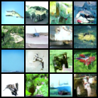
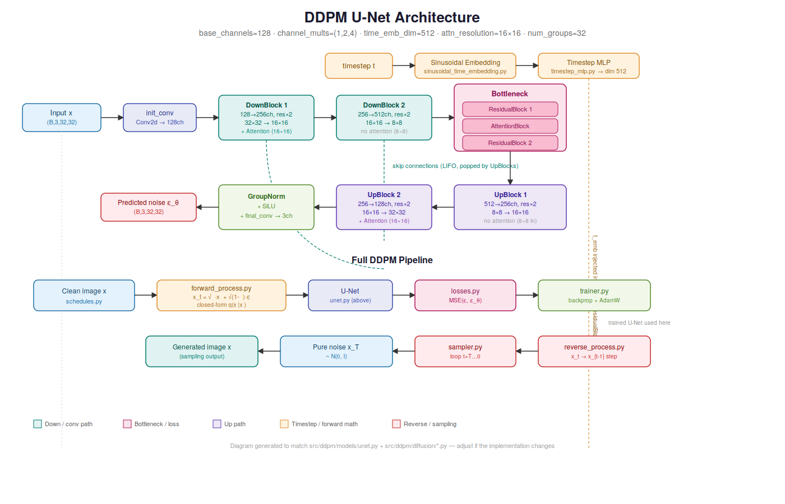

# DDPM From Scratch


A complete implementation of **Denoising Diffusion Probabilistic Models (DDPM)** built from scratch in **PyTorch**, with a strong emphasis on understanding the mathematics, architecture, and implementation details behind one of the most influential generative models in modern deep learning.

Rather than treating diffusion models as black boxes, this project focuses on building every major component from the ground up while carefully studying the theory introduced in the original DDPM paper.

---

# Philosophy

> **"If I cannot build it, then I do not truly understand it."**

This sentence has become the guiding principle behind all of my machine learning projects.

My objective is not simply to reproduce research papers or obtain good-looking results. Instead, I aim to deeply understand **why** an algorithm works by deriving its mathematics, implementing each component myself, testing every module independently, and finally training the complete model.

This repository represents that philosophy applied to **Denoising Diffusion Probabilistic Models (DDPM)**.

Throughout this project I:

- studied the mathematics behind diffusion models
- derived the forward and reverse diffusion equations
- implemented the complete denoising pipeline
- built the U-Net architecture used for noise prediction
- implemented the training algorithm presented in the original paper
- validated every component with unit tests
- trained the model on the CIFAR-10 dataset

Building every component from scratch transformed the DDPM paper from a collection of equations into an implementation that I truly understand.

---

# Generated Samples

Below are samples generated by the model after training on the **CIFAR-10** dataset.

<p align="center">
    
</p>

Although this project is primarily educational, the implementation is capable of generating coherent images after training.

---

# Architecture

The overall DDPM architecture implemented in this repository.

<p align="center">
    
</p>

The model follows the original DDPM pipeline:

```
Image
   │
   ▼
Forward Diffusion (Noise Addition)
   │
   ▼
Random Noisy Image xₜ
   │
   ▼
U-Net predicts the added noise ε
   │
   ▼
Reverse Diffusion
   │
   ▼
Generated Image
```

---

# Features

## Mathematical Implementation

- Forward diffusion process
- Reverse diffusion process
- Closed-form noising equation
- Noise prediction objective
- DDPM training objective
- Linear beta schedule
- Cosine beta schedule
- DDPM sampling algorithm

---

## Neural Network Components

Implemented from scratch:

- Sinusoidal Time Embeddings
- Time Embedding MLP
- Residual Blocks
- Self-Attention Blocks
- Downsampling Blocks
- Upsampling Blocks
- U-Net Architecture

Custom neural network layers:

- Conv2D
- Linear
- Group Normalization
- Dropout
- Sequential Container
- Multi-Head Self-Attention

---

## Training Utilities

- CIFAR-10 Dataset Loader
- Image Transformations
- AdamW Optimizer
- Cosine Annealing Scheduler
- Checkpoint Saving & Loading
- Resume Training
- Multi-GPU Training (DataParallel)
- Random Seed Utilities

---

## Testing

Every important component is accompanied by dedicated unit tests.

The project includes tests for:

- Neural network modules
- Diffusion process
- Sampling
- Schedules
- Time embeddings
- Residual blocks
- U-Net
- Checkpointing

---

# Repository Structure

```
ddpm-from-scratch/
│
├── configs/
│
├── data/
│
├── notebooks/
│
├── scripts/
│   ├── train.py
│   └── sample.py
│
├── src/
│   └── ddpm/
│       ├── datasets/
│       ├── diffusion/
│       ├── models/
│       ├── nn/
│       ├── trainers/
│       └── utils/
│
├── tests/
│
├── assets/
│   ├── generated_samples.png
│   └── architecture.png
│
├── requirements.txt
├── pyproject.toml
└── README.md
```

---

# Project Organization

The repository is organized into independent modules to make every component easy to study, test, and extend.

| Folder | Description |
|---------|-------------|
| `datasets/` | CIFAR-10 loader and preprocessing |
| `diffusion/` | Forward process, reverse process, sampler, schedules, losses |
| `models/` | U-Net, embeddings, residual blocks, attention |
| `nn/` | Custom neural network building blocks |
| `trainers/` | DDPM training loop |
| `utils/` | Checkpointing, metrics, utilities |
| `tests/` | Unit tests for every module |
| `scripts/` | Training and sampling entry points |

The modular design makes it straightforward to understand each individual component without navigating a monolithic implementation.
# Mathematical Background

Denoising Diffusion Probabilistic Models (DDPM), introduced by **Ho et al. (2020)**, are a class of generative models that learn to generate realistic images by gradually reversing a stochastic noising process.

Instead of directly learning to generate an image, DDPM learns to **predict the Gaussian noise** that was added to an image during the forward diffusion process.

The complete algorithm consists of two Markov chains:

- **Forward Diffusion:** progressively destroys information by adding Gaussian noise.
- **Reverse Diffusion:** gradually removes the noise to recover a realistic image.

---

## Forward Diffusion

The forward process is defined as

<p align="center">

$q(x_t|x_{t-1})=\mathcal{N}\left(\sqrt{\alpha_t}x_{t-1},(1-\alpha_t)I\right)$

</p>

where

- $\beta_{t}$ is the noise schedule
- $\alpha_{t} = 1-\beta_{t}$
- $\bar{\alpha}\_{t}=\prod\_{s=1}^{t}\alpha\_{s}$

Using the reparameterization trick, we can directly sample any timestep without iteratively adding noise:

<p align="center">

$x_t=\sqrt{\bar{\alpha}_t}x_0+\sqrt{1-\bar{\alpha}_t}\epsilon,\qquad
\epsilon\sim\mathcal N(0,I)$

</p>

This closed-form equation is implemented in

```
src/ddpm/diffusion/forward_process.py
```

---

## Reverse Diffusion

The reverse process attempts to recover the original image by progressively removing the predicted noise.

Instead of predicting the image directly, the neural network predicts

<p align="center">

$\epsilon_\theta(x_t,t)$

</p>

which represents the Gaussian noise added during the forward process.

The reverse transition is

<p align="center">

$p_\theta(x_{t-1}|x_t)$

</p>

implemented in

```
src/ddpm/diffusion/reverse_process.py
```

---

## Training Objective

Following the original DDPM paper, the simplified objective is used.

Instead of maximizing the complete variational bound, the model minimizes the mean squared error between the true noise and the predicted noise:

<p align="center">

$L_{simple}=E_{x_0,\epsilon,t}
\left[
\left\|
\epsilon-\epsilon_\theta(x_t,t)
\right\|^2
\right]$

</p>

This objective proved to be both simpler and more effective in practice.

---

# U-Net Architecture

The denoising network is a U-Net conditioned on diffusion timesteps.

The architecture consists of

- Sinusoidal timestep embeddings
- Time embedding MLP
- Residual blocks
- Self-attention blocks
- Downsampling path
- Bottleneck
- Upsampling path
- Final convolution layer predicting Gaussian noise

The implementation can be found in

```
src/ddpm/models/unet.py
```

---

# Installation

Clone the repository

```bash
git clone https://github.com/Zanteni/ddpm-from-scratch.git
cd ddpm-from-scratch
```

---

## Method 1 — Install dependencies

```bash
pip install -r requirements.txt
```

---

## Method 2 — Editable installation

```bash
pip install -e .
```

This allows the package to be imported directly from anywhere on your machine while automatically reflecting local code changes.

---

# Training

The main training script is

```bash
python scripts/train.py
```

The training loop follows **Algorithm 1** from the original DDPM paper.

During each iteration the algorithm

1. samples an image
2. samples a random timestep
3. adds Gaussian noise
4. predicts the added noise with the U-Net
5. computes the MSE loss
6. updates the model parameters using AdamW

Checkpointing allows interrupted training sessions to resume seamlessly.

---

# Sampling

Once training is complete, new images can be generated using

```bash
python scripts/sample.py
```

Sampling starts from pure Gaussian noise and iteratively applies the learned reverse diffusion process until a clean image is obtained.

---

# Training Configuration

The model was trained on **CIFAR-10** using the following configuration.

| Hyperparameter | Value |
|----------------|------:|
| Dataset | CIFAR-10 |
| Image Size | 32 × 32 |
| Timesteps | 1000 |
| Batch Size | 64 |
| Optimizer | AdamW |
| Learning Rate | 2e-4 |
| Scheduler | Cosine Annealing |
| Base Channels | 128 |
| Channel Multipliers | (1, 2, 4) |
| Time Embedding Dimension | 512 |
| Residual Blocks / Stage | 2 |
| GroupNorm Groups | 32 |
| Attention Resolution | 16 × 16 |
| Total Parameters | ~37.2M |
| Epochs Trained | 20 |
| Hardware | Kaggle GPU T4 ×2 |
| Training Duration | ~6h 8min |

---

# Training Pipeline

The complete pipeline implemented in this repository is

```
Input Image
      │
      ▼
Sample Random Timestep t
      │
      ▼
Add Gaussian Noise
      │
      ▼
Noisy Image xₜ
      │
      ▼
U-Net
      │
      ▼
Predict Noise ε
      │
      ▼
Compute MSE Loss
      │
      ▼
Backpropagation
      │
      ▼
Update Parameters
```

This process is repeated for every mini-batch until the model learns to accurately estimate the added Gaussian noise.
---

# Results

After training on the **CIFAR-10** dataset, the implemented DDPM is capable of generating coherent images from pure Gaussian noise.

Although this repository is primarily educational, the model successfully learns the reverse diffusion process and demonstrates the effectiveness of DDPMs for image generation.

Some generated samples are shown below.

<p align="center">
    
</p>

The quality of the generated images improves as training progresses and can
be further enhanced through longer training, improved sampling techniques,
and additional architectural improvements.

---

# Limitations

This model was trained for only **20 epochs** (~6h 8min) on Kaggle's GPU T4 ×2,
which is short compared to typical DDPM training runs — the original paper
trains for the equivalent of hundreds of thousands of steps, often over days
on multi-GPU setups. As a result, generated samples are recognizable but not
yet fully sharp/photorealistic. Since the ~37M parameter U-Net is comparable
in size to the original paper's CIFAR-10 model, the gap in quality is almost
entirely due to limited training time rather than architecture capacity —
more epochs, EMA, and the improvements listed under Future Work should close
most of the remaining gap.

---

# Testing

Reliability was an important part of this project.

Rather than assuming every component worked correctly, each major module was implemented alongside dedicated unit tests.

The project currently includes tests for

- Neural network layers
- Time embeddings
- Residual blocks
- Attention blocks
- U-Net
- Diffusion schedules
- Forward diffusion process
- Reverse diffusion process
- Sampling
- Checkpoint saving and loading

The objective is to ensure that every module behaves correctly before being integrated into the complete DDPM pipeline.

---

# Future Work

This repository is intended to evolve as I continue learning about diffusion models.

Planned improvements include

- Exponential Moving Average (EMA)
- Cosine Noise Schedule
- Mixed Precision Training
- Hugging Face Accelerate
- Weights & Biases integration
- DDIM sampling
- Classifier-Free Guidance (CFG)
- Latent Diffusion Models
- Stable Diffusion
- Training on larger and more diverse datasets

The long-term goal is to progressively build more advanced diffusion architectures while maintaining the same philosophy of understanding every component through implementation.

---

# Lessons Learned

Working on this project taught me far more than simply implementing another deep learning model.

Throughout this journey I gained a deeper understanding of

- Diffusion probabilistic models
- Variational inference
- Forward and reverse Markov processes
- Noise schedules
- U-Net architectures
- Time embeddings
- Self-attention in diffusion models
- Training large generative models
- PyTorch engineering practices
- Software organization and testing

More importantly, I learned that understanding comes from building.

Reading papers provides intuition.

Implementing every equation provides understanding.

# References

This implementation is primarily based on the original DDPM paper.

### Primary Reference

Ho, J., Jain, A., & Abbeel, P. (2020).

**Denoising Diffusion Probabilistic Models**

https://arxiv.org/abs/2006.11239

---

### Additional Reading

Song, J., Meng, C., & Ermon, S. (2020).

**Denoising Diffusion Implicit Models**

https://arxiv.org/abs/2010.02502

---

Rombach, R., Blattmann, A., Lorenz, D., Esser, P., & Ommer, B. (2022).

**High-Resolution Image Synthesis with Latent Diffusion Models**

https://arxiv.org/abs/2112.10752

---

# License

This project is released under the **MIT License**.

See the `LICENSE` file for more information.

---

# Acknowledgements

I would like to thank the authors of the original DDPM paper for making this fascinating line of research accessible to the machine learning community.

I am also grateful to the open-source community whose educational resources, discussions, and implementations have made learning modern generative models possible.

# Author

**Wajdi Zanteni**

Second-Year Engineering Student at Sup'Com

Training Manager at MLS (Machine Learning Sup'Com)

Member of RLS Research Labs – Sup'Com

Passionate about understanding machine learning by deriving the mathematics and building models from scratch.

---

# Resources

The project is available both as a GitHub repository and as an interactive Kaggle notebook.

- **GitHub Repository:** [DDPM From Scratch](https://github.com/Zanteni/ddpm-from-scratch)
- **Kaggle Notebook:** [DDPM From Scratch on Kaggle](https://www.kaggle.com/code/zanteniwajdi/ddpm-from-scratch)

# Final Thoughts

> **"I believe the best way to understand machine learning is to build it. If I cannot build it, then I do not truly understand it."**

This repository is more than just an implementation of DDPM.

It represents my approach to learning machine learning: starting from the mathematical foundations, deriving the equations, implementing every component from scratch, validating each module through testing, and finally assembling everything into a complete working system.

Building this project transformed diffusion models from a collection of equations into something I genuinely understand. Along the way, I gained a deeper appreciation for the beauty of probabilistic generative models and the engineering behind modern AI.

I hope this repository helps others who want to go beyond using models and truly understand how they work.

Happy learning! 🚀

⭐ If you found this repository useful, consider giving it a star!